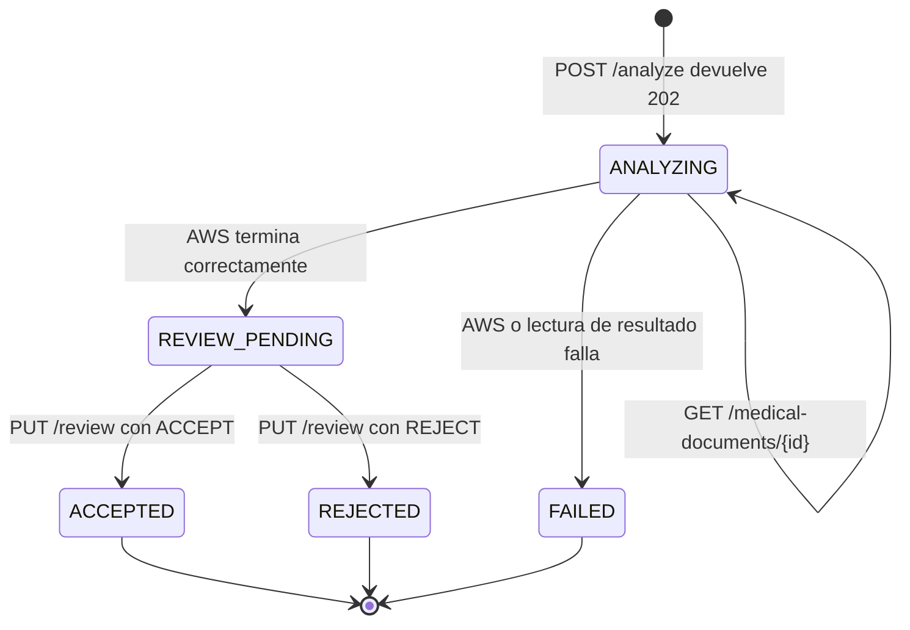

# Integracion frontend: documentos medicos con IA

## Proposito y audiencia

Este documento contextualiza a una IA o a un equipo que implemente el flujo de
documentos medicos en la aplicacion frontend de AnimalRecord.

Es una especificacion de integracion. Describe:

- Las reglas de negocio que el frontend no debe reinterpretar.
- Los endpoints reales del backend y sus contratos.
- El orden completo de solicitudes HTTP.
- El manejo del analisis asincrono y el polling.
- La revision humana, aceptacion y rechazo.
- La consulta posterior de datos estructurados desde MongoDB.
- La descarga opcional del archivo original.
- Los estados, errores, casos limite y restricciones actuales.

Antes de modificar estas reglas se debe leer
[`medical-document-strategy.md`](./medical-document-strategy.md). La
implementacion tecnica actual se describe en
[`medical-document-ai.md`](./medical-document-ai.md).

## Resumen ejecutivo

El flujo no consiste simplemente en subir un archivo y guardarlo.

1. El frontend conoce desde el inicio uno o varios animales.
2. Envia el archivo y, opcionalmente, la categoria desde la que se inicio la
   carga.
3. El backend responde `202 Accepted` y empieza un analisis asincrono en AWS.
4. El frontend consulta el documento por ID hasta que termine el analisis.
5. La IA puede detectar cero, una o varias categorias.
6. El usuario revisa los datos y elige exactamente una categoria final.
7. Si acepta, el frontend envia la extraccion completa ya validada y una
   asignacion por cada animal.
8. El backend guarda el archivo en la carpeta final de cada animal y conserva
   en MongoDB solo los datos estructurados de la categoria elegida.
9. Si rechaza, no se crean copias finales; el archivo temporal se elimina y el
   registro rechazado permanece en MongoDB para auditoria.
10. Las pantallas medicas consultan los datos aceptados en MongoDB. No necesitan
    descargar ni interpretar el archivo para mostrarlos.

La IA recomienda y extrae. El usuario siempre toma la decision final.

## Autenticacion y convenciones HTTP

Todos los endpoints de este documento requieren JWT:

```http
Authorization: Bearer <access-token>
```

No se debe fijar la URL del servidor en el codigo. Usar la variable de entorno
o configuracion de API del frontend:

```text
{API_BASE_URL}/medical-documents/...
```

Salvo la carga inicial, las solicitudes y respuestas usan
`application/json`. La carga inicial usa `multipart/form-data`.

El backend valida que el documento y todos los animales pertenezcan al usuario
autenticado. El frontend no debe confiar solo en IDs almacenados localmente.

## Categorias canonicas

Usar exactamente estos valores en red, estado y modelos:

```ts
export type MedicalDocumentCategory =
  | 'PRESCRIPTION'
  | 'MEDICAL_ORDER'
  | 'REFERRAL'
  | 'VACCINATION_CARD'
  | 'CLINICAL_HISTORY'
  | 'OTHER';
```

Significado:

| Valor              | Pantalla o categoria                                            |
| ------------------ | --------------------------------------------------------------- |
| `PRESCRIPTION`     | Formula o prescripcion medica                                   |
| `MEDICAL_ORDER`    | Orden de examen, procedimiento, control o valoracion            |
| `REFERRAL`         | Remision veterinaria                                            |
| `VACCINATION_CARD` | Carne, certificado o historial de vacunacion                    |
| `CLINICAL_HISTORY` | Historia, ficha, resumen o expediente clinico                   |
| `OTHER`            | Documento que no coincide de forma confiable con las anteriores |

`OTHER` es un fallback. No se presenta como una categoria medica detectada
junto a otras categorias, pero el usuario puede elegirla como categoria final.

## Conceptos que no deben mezclarse

### `requestedCategory`

Categoria opcional elegida antes del analisis.

- Si el usuario entra por la seccion "Formulas", enviar `PRESCRIPTION`.
- Si entra por "Ordenes", enviar `MEDICAL_ORDER`.
- Si entra por "Remisiones", enviar `REFERRAL`.
- Si entra por "Vacunas", enviar `VACCINATION_CARD`.
- Si entra por "Historia clinica", enviar `CLINICAL_HISTORY`.
- Si usa la carga general, omitir completamente el campo.

Este valor expresa contexto de navegacion. No obliga a la IA ni se convierte
automaticamente en la categoria final.

### `detectedCategories`

Lista inmutable de categorias detectadas por la IA. Puede incluir confianza,
rango de paginas, resumen y evidencia. El frontend solo la muestra; nunca debe
editarla para representar la decision del usuario.

### `primaryDetectedCategory`

Recomendacion de la IA sobre el proposito principal del archivo. Puede no
existir cuando el archivo no se clasifico con suficiente confianza.

### `finalCategory`

Unica categoria confirmada por el usuario durante la aceptacion. Controla:

- La carpeta final del archivo.
- Los datos estructurados que se conservan.
- La vista medica en la que aparecera el documento.

El usuario puede elegir la categoria solicitada, una detectada, la principal,
`OTHER` o cualquier otra categoria valida. La deteccion no impone la decision.

### `classificationOutcome`

```ts
export type ClassificationOutcome =
  | 'MATCH'
  | 'MISMATCH'
  | 'MATCH_WITH_ADDITIONAL'
  | 'MULTIPLE'
  | 'DETECTED'
  | 'UNCLASSIFIED';
```

| Resultado               | Interpretacion de UI                                      |
| ----------------------- | --------------------------------------------------------- |
| `MATCH`                 | La categoria solicitada fue la unica detectada            |
| `MISMATCH`              | La categoria solicitada no fue detectada; se detecto otra |
| `MATCH_WITH_ADDITIONAL` | Se detecto la solicitada y tambien otras                  |
| `MULTIPLE`              | Carga general con varias categorias detectadas            |
| `DETECTED`              | Carga general con una categoria detectada                 |
| `UNCLASSIFIED`          | No se detecto una categoria medica confiable              |

Una diferencia genera una advertencia y una eleccion, no un rechazo automatico.

## Maquina de estados

```ts
export type MedicalDocumentStatus =
  | 'PENDING_UPLOAD'
  | 'ANALYZING'
  | 'REVIEW_PENDING'
  | 'ACCEPTED'
  | 'REJECTED'
  | 'FAILED';
```



Reglas de UI:

- Mostrar progreso y bloquear revision durante `ANALYZING`.
- Mostrar editor y decisiones solo durante `REVIEW_PENDING`.
- Mostrar confirmacion y navegar a la categoria final en `ACCEPTED`.
- Cerrar el flujo sin crear un documento visible para el animal en `REJECTED`.
- Mostrar un error recuperable en `FAILED`; actualmente no existe endpoint para
  reiniciar ese mismo registro.
- `PENDING_UPLOAD` es un estado interno/transitorio. Una respuesta exitosa del
  POST normalmente ya llega como `ANALYZING`.

No intentar aceptar o rechazar mientras el estado sea `ANALYZING`; el backend
respondera `409 Conflict` porque solo permite revisar `REVIEW_PENDING`.

## Contrato comun de respuesta

Todos los endpoints que devuelven un documento usan esta forma publica. Las
claves de S3 y los metadatos internos de AWS nunca se exponen.

```ts
export interface MedicalDocumentResponse {
  id: string;
  animalIds: string[];
  originalFileName: string;
  mimeType: 'application/pdf' | 'image/jpeg' | 'image/png' | 'image/tiff';
  fileSize: number;
  status: MedicalDocumentStatus;
  requestedCategory?: MedicalDocumentCategory;
  primaryDetectedCategory?: MedicalDocumentCategory;
  detectedCategories: DetectedCategory[];
  classificationOutcome?: ClassificationOutcome;
  extractionsByCategory: Partial<
    Record<MedicalDocumentCategory, MedicalDocumentExtraction>
  >;
  finalCategory?: MedicalDocumentCategory;
  validatedExtraction?: MedicalDocumentExtraction;
  assignments: MedicalDocumentAssignment[];
  version: number;
  createdAt: string;
  updatedAt: string;
  reviewedAt?: string;
}

export interface DetectedCategory {
  category: MedicalDocumentCategory;
  confidence?: number; // 0..1
  pageStart?: number; // basado en 1 e inclusivo
  pageEnd?: number; // basado en 1 e inclusivo
  summary?: string;
  evidence?: string;
}
```

`version` implementa bloqueo optimista. Nunca asumir que siempre vale `1`.
Enviar en la revision el ultimo valor recibido por GET.

## Contrato de extraccion

```ts
export interface ExtractionSource {
  page?: number;
  text?: string;
}

export interface ExtractedItemBase {
  id: string;
  confidence?: number;
  source?: ExtractionSource;
}

export interface ExtractedDiagnosis extends ExtractedItemBase {
  name: string;
  code?: string;
  notes?: string;
}

export interface ExtractedMedication extends ExtractedItemBase {
  name: string;
  activeIngredient?: string;
  presentation?: string;
  dose?: string;
  route?: string;
  frequency?: string;
  duration?: string;
  instructions?: string;
}

export interface ExtractedVaccination extends ExtractedItemBase {
  name: string;
  diseasesCovered?: string[];
  brand?: string;
  manufacturer?: string;
  vaccineType?: string;
  lot?: string;
  lotExpirationDate?: string;
  applicationDate?: string;
  nextDoseDate?: string;
  route?: string;
  applicationSite?: string;
  tagNumber?: string;
  veterinarian?: string;
}

export interface ExtractedMedicalOrder extends ExtractedItemBase {
  name: string;
  orderType?: string;
  instructions?: string;
  priority?: string;
}

export interface ExtractedDiagnosticResult extends ExtractedItemBase {
  name: string;
  date?: string;
  result?: string;
  interpretation?: string;
  status?: string;
}

export interface ExtractedClinicalHistory {
  reasonForConsultation?: string;
  anamnesis?: string;
  physicalExam?: string;
  vitalSigns?: string[];
  clinicalFindings?: string[];
  evolution?: string;
  treatmentPlan?: string;
  recommendations?: string[];
  followUp?: string;
  prognosis?: string;
  confidence?: number;
  source?: ExtractionSource;
}

export interface ExtractedReferral {
  reason?: string;
  destination?: string;
  specialty?: string;
  clinicalSummary?: string;
  confidence?: number;
  source?: ExtractionSource;
}

export interface ExtractedPatient {
  name?: string;
  identifier?: string;
  species?: string;
  breed?: string;
  sex?: string;
  color?: string;
  size?: string;
  reproductiveStatus?: string;
  age?: string;
  birthDate?: string;
  weight?: string;
  microchip?: string;
}

export interface ExtractedOwner {
  name?: string;
  identification?: string;
  phone?: string;
  email?: string;
  address?: string;
}

export interface MedicalDocumentExtraction {
  documentType: MedicalDocumentCategory;
  documentTypeConfidence?: number;
  summary?: string;
  documentDate?: string;
  issuer?: {
    name?: string;
    clinic?: string;
    professionalId?: string;
  };
  patient?: ExtractedPatient;
  owner?: ExtractedOwner;
  patientHints: string[];
  diagnoses: ExtractedDiagnosis[];
  medications: ExtractedMedication[];
  vaccinations: ExtractedVaccination[];
  medicalOrders: ExtractedMedicalOrder[];
  clinicalHistory?: ExtractedClinicalHistory;
  diagnosticResults?: ExtractedDiagnosticResult[];
  referral?: ExtractedReferral;
  additionalFields: Record<string, unknown>;
  warnings: string[];
}

export interface MedicalDocumentAssignment {
  animalId: string;
  extractedItemIds: string[];
}
```

Aunque algunas secciones no apliquen, estas propiedades siempre son arreglos y
deben enviarse durante la aceptacion:

- `patientHints`
- `diagnoses`
- `medications`
- `vaccinations`
- `medicalOrders`
- `warnings`

`additionalFields` tambien es obligatorio y puede enviarse como `{}`.

`patient` y `owner` son objetos opcionales. El frontend debe mostrar sus datos
por nombre de propiedad y omitir campos ausentes. `patientHints` se conserva
solo para compatibilidad o fragmentos no mapeados: nunca interpretar su orden
como nombre, especie, raza, edad u otro significado.

## Flujo HTTP completo

### Paso 1: seleccionar animales, archivo y contexto

Antes de cargar:

- Debe existir al menos un `animalId`.
- Cada ID debe ser UUID v4.
- Se permiten PDF, JPEG, PNG y TIFF.
- El limite de la aplicacion es 10 MB.
- Validar tamano y tipo en frontend mejora la experiencia, pero el backend
  vuelve a validar el MIME y la firma binaria real.

Una extension renombrada no es suficiente. Por ejemplo, un archivo que se llame
`.pdf` pero contenga bytes de una imagen sera rechazado.

### Paso 2: iniciar el analisis

```http
POST /medical-documents/analyze
Content-Type: multipart/form-data
Authorization: Bearer <token>
```

Campos:

| Campo               | Obligatorio | Forma              |
| ------------------- | ----------- | ------------------ |
| `file`              | Si          | Archivo binario    |
| `animalIds`         | Si          | Uno o mas UUID     |
| `requestedCategory` | No          | Categoria canonica |

El backend acepta `animalIds` como arreglo JSON, campo repetido o UUID separados
por comas. La forma recomendada para React Native es un arreglo JSON:

```ts
const formData = new FormData();
formData.append('file', {
  uri: selectedFile.uri,
  name: selectedFile.name,
  type: selectedFile.mimeType,
} as never);
formData.append('animalIds', JSON.stringify(animalIds));

if (requestedCategory) {
  formData.append('requestedCategory', requestedCategory);
}

const response = await api.post<MedicalDocumentResponse>(
  '/medical-documents/analyze',
  formData,
  { headers: { 'Content-Type': 'multipart/form-data' } },
);
```

Nota para clientes HTTP: cuando la libreria agrega el boundary automaticamente,
es preferible no escribir manualmente el encabezado `Content-Type`.

Respuesta exitosa:

```http
202 Accepted
```

```json
{
  "id": "6332e182-3347-4728-b15f-5d1529f73092",
  "animalIds": ["bd4023d6-c745-4d29-9a61-4da558744b5f"],
  "originalFileName": "Formula 3.pdf",
  "mimeType": "application/pdf",
  "fileSize": 345516,
  "status": "ANALYZING",
  "requestedCategory": "PRESCRIPTION",
  "detectedCategories": [],
  "extractionsByCategory": {},
  "assignments": [],
  "version": 1,
  "createdAt": "2026-08-08T00:25:52.775Z",
  "updatedAt": "2026-08-08T00:25:53.000Z"
}
```

Guardar inmediatamente el `id`. Es la unica forma actual de retomar un analisis
no aceptado, porque el endpoint de lista por animal devuelve solo documentos
aceptados.

No repetir automaticamente el POST ante timeout. Actualmente no existe una
clave de idempotencia proporcionada por el frontend; un reintento puede crear
otro registro si el servidor alcanzo a recibir la primera solicitud.

### Paso 3: consultar el analisis asincrono

```http
GET /medical-documents/{documentId}
Authorization: Bearer <token>
```

Este GET no es una lectura pasiva mientras el estado sea `ANALYZING`: tambien
consulta AWS y, cuando el trabajo termina, consolida y persiste el resultado.
Por eso el polling del frontend forma parte del flujo actual.

Estrategia recomendada:

1. Hacer el primer GET entre 1 y 2 segundos despues del POST.
2. Mientras responda `ANALYZING`, esperar antes del siguiente GET.
3. Usar intervalos aproximados de `2 s`, `3 s` y luego `5 s` como maximo.
4. Nunca enviar dos GET simultaneos para el mismo documento.
5. Pausar polling cuando la app pase a segundo plano.
6. Reanudarlo al volver, usando el `documentId` guardado.
7. Detenerlo en `REVIEW_PENDING`, `FAILED`, `ACCEPTED` o `REJECTED`.
8. Cancelar timers y `AbortController` al desmontar la pantalla.

Pseudocodigo:

```ts
async function pollMedicalDocument(
  documentId: string,
  signal: AbortSignal,
): Promise<MedicalDocumentResponse> {
  const delays = [2000, 3000, 5000];
  let attempt = 0;

  while (!signal.aborted) {
    const document = await api.get<MedicalDocumentResponse>(
      `/medical-documents/${documentId}`,
      { signal },
    );

    if (document.status !== 'ANALYZING') return document;

    const delay = delays[Math.min(attempt, delays.length - 1)];
    await sleep(delay, signal);
    attempt += 1;
  }

  throw new DOMException('Polling cancelled', 'AbortError');
}
```

No imponer un timeout corto que haga perder el flujo. Si la espera supera el
tiempo de UX definido por producto, ofrecer "Continuar esperando" o "Revisar
mas tarde" y conservar el ID. No crear otra carga de forma automatica.

Respuesta final de ejemplo:

```json
{
  "id": "6332e182-3347-4728-b15f-5d1529f73092",
  "animalIds": ["bd4023d6-c745-4d29-9a61-4da558744b5f"],
  "status": "REVIEW_PENDING",
  "requestedCategory": "PRESCRIPTION",
  "primaryDetectedCategory": "PRESCRIPTION",
  "detectedCategories": [
    {
      "category": "PRESCRIPTION",
      "confidence": 0.67327315,
      "pageStart": 1,
      "pageEnd": 1,
      "summary": "Formula veterinaria con medicamentos",
      "evidence": "Formula Medica"
    }
  ],
  "classificationOutcome": "MATCH",
  "extractionsByCategory": {
    "PRESCRIPTION": {
      "documentType": "PRESCRIPTION",
      "documentDate": "2024-06-20",
      "patient": {
        "name": "EITHAN",
        "species": "Canino",
        "breed": "Samoyedo"
      },
      "patientHints": [],
      "diagnoses": [],
      "medications": [],
      "vaccinations": [],
      "medicalOrders": [],
      "additionalFields": {},
      "warnings": []
    }
  },
  "assignments": [],
  "version": 1
}
```

### Paso 4: presentar la clasificacion

La pantalla debe separar visualmente:

- Categoria seleccionada inicialmente.
- Categoria principal sugerida por la IA.
- Todas las categorias detectadas.
- Advertencia de coincidencia o diferencia.
- Rango de paginas y evidencia, cuando existan.
- Selector de categoria final controlado por el usuario.

Comportamiento sugerido:

- `MATCH`: preseleccionar la categoria solicitada.
- `MISMATCH`: explicar que se detecto otra categoria y ofrecer conservar la
  seleccion original o usar la detectada.
- `MATCH_WITH_ADDITIONAL`: preseleccionar la solicitada, pero mostrar las
  categorias adicionales.
- `DETECTED`: preseleccionar la unica categoria detectada.
- `MULTIPLE`: preseleccionar la principal solo como sugerencia y exigir
  confirmacion explicita.
- `UNCLASSIFIED`: no afirmar que el archivo es invalido; permitir elegir una
  categoria y completar manualmente sus campos.

El usuario debe poder cambiar la seleccion antes de aceptar.

### Paso 5: construir el editor de revision

Si existe:

```ts
document.extractionsByCategory[finalCategory];
```

usar una copia profunda como estado inicial del formulario. No modificar la
respuesta original ni `detectedCategories`.

Si no existe extraccion para la categoria que el usuario eligio manualmente,
crear un contrato vacio:

```ts
function emptyExtraction(
  category: MedicalDocumentCategory,
): MedicalDocumentExtraction {
  return {
    documentType: category,
    patientHints: [],
    diagnoses: [],
    medications: [],
    vaccinations: [],
    medicalOrders: [],
    additionalFields: {},
    warnings: [],
  };
}
```

La aceptacion envia el objeto completo, no un patch. El usuario puede:

- Corregir texto.
- Eliminar datos incorrectos.
- Agregar datos legibles que la IA omitio.
- Dejar vacios campos no presentes.

Los IDs de items deben ser estables y unicos entre diagnosticos,
medicamentos, vacunas, ordenes y resultados. Si el usuario agrega una fila,
generar un ID unico y conservarlo hasta enviar la revision.

No usar `patient`, `owner` ni `patientHints` para cambiar automaticamente los
animales asociados. Los animales ya fueron elegidos antes de analizar.

### Paso 6A: aceptar

```http
PUT /medical-documents/{documentId}/review
Content-Type: application/json
Authorization: Bearer <token>
```

```json
{
  "decision": "ACCEPT",
  "documentVersion": 1,
  "finalCategory": "PRESCRIPTION",
  "validatedExtraction": {
    "documentType": "PRESCRIPTION",
    "documentDate": "2024-06-20",
    "issuer": {
      "name": "NATALIA LOPEZ",
      "clinic": "CISVET CLINICA VETERINARIA",
      "professionalId": "41611"
    },
    "patient": {
      "name": "EITHAN",
      "species": "Canino",
      "breed": "Samoyedo"
    },
    "patientHints": [],
    "diagnoses": [],
    "medications": [
      {
        "id": "medication-1",
        "name": "Flativet",
        "presentation": "suspension",
        "route": "oral",
        "frequency": "cada 12 horas"
      }
    ],
    "vaccinations": [],
    "medicalOrders": [],
    "additionalFields": {},
    "warnings": []
  },
  "assignments": [
    {
      "animalId": "bd4023d6-c745-4d29-9a61-4da558744b5f",
      "extractedItemIds": ["medication-1"]
    }
  ]
}
```

Invariantes obligatorias:

- `documentVersion` es la ultima version recibida.
- `finalCategory` es obligatoria.
- `validatedExtraction.documentType` debe ser igual a `finalCategory`.
- Debe existir exactamente una asignacion por cada `animalId` original.
- Un animal puede recibir cero items usando `extractedItemIds: []`, pero su
  asignacion sigue siendo obligatoria.
- Cada ID asignado debe existir en la extraccion validada.
- Los IDs de todos los items deben ser unicos.
- Si se elimina una fila del formulario, eliminar tambien su ID de todas las
  asignaciones.
- No enviar datos estructurados de dos categorias a la vez.

Secciones estructuradas permitidas por categoria:

Los campos comunes son `summary`, `documentDate`, `issuer`, `patient`, `owner`,
`patientHints`, `additionalFields` y `warnings`. `patient` y `owner` pueden
editarse durante la revision, pero solo deben contener informacion visible y
validada por el usuario.

| Categoria final    | Secciones permitidas ademas de campos comunes                        |
| ------------------ | -------------------------------------------------------------------- |
| `PRESCRIPTION`     | `diagnoses`, `medications`                                           |
| `MEDICAL_ORDER`    | `diagnoses`, `medicalOrders`                                         |
| `REFERRAL`         | `diagnoses`, `medications`, `diagnosticResults`, `referral`          |
| `VACCINATION_CARD` | `vaccinations`                                                       |
| `CLINICAL_HISTORY` | `diagnoses`, `clinicalHistory`, `diagnosticResults`                  |
| `OTHER`            | Ninguna seccion categorica; usar campos comunes y `additionalFields` |

Las demas secciones deben enviarse vacias u omitirse cuando sean opcionales. El
backend devuelve `400` si la extraccion mezcla categorias.

Ejemplo importante: si una historia contiene una formula y el usuario elige
`CLINICAL_HISTORY`, no enviar sus medicamentos en `medications`. Pueden quedar
descritos como texto dentro de `clinicalHistory.treatmentPlan`, pero no como
registros estructurados de prescripcion.

Respuesta exitosa:

```http
200 OK
```

El estado sera `ACCEPTED`, aparecera `finalCategory`, se incluira
`validatedExtraction`, y `version` habra aumentado. El frontend debe reemplazar
su estado local con toda la respuesta del servidor.

Efectos backend de la aceptacion:

- Copia el archivo original a la carpeta final de cada animal.
- Conserva una ubicacion final por animal.
- Elimina el archivo de ingreso y la salida temporal de AWS.
- Guarda `finalCategory`, `validatedExtraction` y `assignments` en MongoDB.
- Conserva como auditoria las categorias detectadas.
- Descarta los payloads clinicos completos de categorias no seleccionadas.
- Aplica al agregado Animal solamente los diagnosticos asignados.
- Los demas datos siguen disponibles dentro de `validatedExtraction` para las
  pantallas medicas.

### Paso 6B: rechazar

El rechazo se usa cuando el usuario decide no conservar el documento.

```http
PUT /medical-documents/{documentId}/review
Content-Type: application/json
Authorization: Bearer <token>
```

```json
{
  "decision": "REJECT",
  "documentVersion": 1
}
```

No enviar `finalCategory`, `validatedExtraction` ni `assignments`.

Efectos:

- Estado final `REJECTED`.
- No se crean copias en las carpetas de los animales.
- Se elimina el archivo temporal y la salida de AWS.
- Se conserva el registro rechazado en MongoDB para auditoria.
- No aparece en `GET /animals/{animalId}/medical-documents`.
- No puede descargarse.

Cerrar la pantalla o presionar "atras" no equivale a rechazar. Si el usuario
confirma que desea descartar, el frontend debe enviar la decision `REJECT`.

Actualmente solo puede rechazarse un documento en `REVIEW_PENDING`. Si el
usuario abandona mientras sigue `ANALYZING`, conservar el ID, terminar el
polling al reanudar y entonces permitir el rechazo.

## Consulta estructurada despues de aceptar

### Todos los documentos aceptados del animal

```http
GET /animals/{animalId}/medical-documents
Authorization: Bearer <token>
```

### Documentos de una categoria

```http
GET /animals/{animalId}/medical-documents?category=PRESCRIPTION
Authorization: Bearer <token>
```

La respuesta es `MedicalDocumentResponse[]`:

- Solo contiene documentos `ACCEPTED`.
- Esta ordenada del mas reciente al mas antiguo.
- El filtro usa `finalCategory`, no la categoria sugerida por la IA.
- Actualmente no tiene paginacion.

Para renderizar una tarjeta o detalle usar:

```ts
document.finalCategory;
document.validatedExtraction;
```

No usar `extractionsByCategory` como fuente de verdad despues de aceptar y no
descargar el archivo para reconstruir la informacion. La descarga es opcional y
`validatedExtraction` ya contiene la informacion aprobada almacenada en
MongoDB.

No existe actualmente un endpoint para listar por animal los documentos
`ANALYZING` o `REVIEW_PENDING`. El frontend debe conservar los IDs de flujos en
curso si necesita reanudarlos.

## Descarga del archivo original

```http
GET /medical-documents/{documentId}/download-url
Authorization: Bearer <token>
```

Solo funciona para documentos `ACCEPTED`.

```json
{
  "downloadUrl": "https://...",
  "expiresIn": 300
}
```

La URL privada vence en cinco minutos. Solicitar una nueva URL cada vez que el
usuario quiera abrir o descargar el documento. No persistirla como si fuera una
URL permanente.

## Politica de errores

Formato general esperado:

```json
{
  "statusCode": 409,
  "message": "The document was modified by another request",
  "path": "/medical-documents/.../review",
  "timestamp": "2026-08-08T00:00:00.000Z"
}
```

### Analisis `POST /medical-documents/analyze`

| Codigo | Accion frontend                                                          |
| ------ | ------------------------------------------------------------------------ |
| `400`  | Mostrar archivo vacio, firma invalida, MIME no soportado o IDs invalidos |
| `401`  | Renovar sesion o autenticar de nuevo                                     |
| `403`  | Alguno de los animales no pertenece al usuario; no continuar             |
| `404`  | Alguno de los animales ya no existe; refrescar seleccion                 |
| `413`  | Pedir un archivo menor de 10 MB                                          |
| `502`  | AWS/S3 no inicio el analisis; permitir reintento manual                  |

No hacer reintento automatico del POST por el riesgo de duplicados.

### Estado `GET /medical-documents/{id}`

| Codigo | Accion frontend                                                     |
| ------ | ------------------------------------------------------------------- |
| `401`  | Renovar sesion y reanudar con el mismo ID                           |
| `403`  | Detener: el documento no pertenece al usuario                       |
| `404`  | Detener: el documento no existe                                     |
| `5xx`  | Mantener el ID, usar backoff y ofrecer reintento sin volver a subir |

Un error de red durante polling no cambia por si mismo el estado del documento.
No convertirlo en `FAILED` local ni crear un nuevo documento.

### Revision `PUT /medical-documents/{id}/review`

| Codigo | Accion frontend                                                 |
| ------ | --------------------------------------------------------------- |
| `400`  | Revisar contrato, IDs, asignaciones o mezcla de categorias      |
| `401`  | Renovar sesion antes de repetir la misma decision               |
| `403`  | Detener: documento o animal de otro usuario                     |
| `404`  | Refrescar: documento o animal inexistente                       |
| `409`  | Hacer GET del documento y usar su estado/version actuales       |
| `502`  | Conservar formulario y permitir reintento; no asumir aceptacion |

Ante `409`, si el GET devuelve `ACCEPTED` o `REJECTED`, respetar el resultado ya
persistido. Si continua `REVIEW_PENDING`, actualizar `documentVersion` y pedir
confirmacion antes de reenviar cambios que podrian haber quedado obsoletos.

### Lista y descarga

- Lista: `400` para categoria invalida; `403/404` para acceso al animal.
- Descarga: `409` si no esta aceptado y `502` si S3 no puede firmar la URL.

## Estado frontend recomendado

Separar estado remoto, formulario y navegacion:

```ts
interface MedicalDocumentFlowState {
  documentId?: string;
  remoteDocument?: MedicalDocumentResponse;
  requestedCategory?: MedicalDocumentCategory;
  selectedFinalCategory?: MedicalDocumentCategory;
  draftExtraction?: MedicalDocumentExtraction;
  assignmentsByAnimalId: Record<string, string[]>;
  phase:
    | 'SELECTING'
    | 'UPLOADING'
    | 'ANALYZING'
    | 'REVIEWING'
    | 'SUBMITTING'
    | 'COMPLETED'
    | 'FAILED';
}
```

No mezclar `selectedFinalCategory` con `requestedCategory` ni sobrescribir
`primaryDetectedCategory` cuando el usuario cambie el selector.

Persistencia local minima para reanudar:

```ts
interface PendingMedicalDocumentFlow {
  documentId: string;
  animalIds: string[];
  startedAt: string;
  entryCategory?: MedicalDocumentCategory;
}
```

Eliminar esta referencia local cuando la respuesta sea `ACCEPTED`, `REJECTED`
o cuando el usuario decida abandonar definitivamente un `FAILED`.

## Casos funcionales que deben probarse en frontend

1. Categoria solicitada coincide con una detectada.
2. Categoria solicitada no coincide y el usuario usa la sugerida.
3. Categoria solicitada no coincide y el usuario conserva la inicial.
4. Categoria solicitada aparece junto a categorias adicionales.
5. Carga general con una categoria.
6. Carga general con varias categorias.
7. Documento sin categoria confiable y captura manual.
8. Historia clinica con formula y vacunas, eligiendo una sola categoria final.
9. Un documento asociado a varios animales con asignaciones diferentes.
10. Un animal recibe una asignacion vacia pero conserva el documento asociado.
11. Correccion y eliminacion de items antes de aceptar.
12. Rechazo despues de terminar el analisis.
13. App en segundo plano y reanudacion del polling.
14. Error de red durante polling sin duplicar la carga.
15. Conflicto `409` durante la revision.
16. Consulta general de documentos aceptados.
17. Consulta filtrada por cada categoria.
18. Descarga con URL expirada y solicitud de una nueva.
19. Archivo mayor de 10 MB o con MIME/firma invalida.
20. Animal eliminado o perteneciente a otro usuario.

## Restricciones actuales y decisiones pendientes

La IA que implemente el frontend debe conocer estas limitaciones para no inventar
endpoints o comportamientos:

- No hay endpoint de cancelacion durante `ANALYZING`.
- No hay endpoint para listar todos los analisis pendientes del usuario.
- No hay paginacion en la lista de documentos aceptados por animal.
- No hay idempotencia de carga controlada por el frontend.
- No se expone `failureReason` en la respuesta publica actual; `FAILED` se
  presenta con un mensaje generico.
- La aceptacion agrega automaticamente al agregado Animal solo los diagnosticos
  asignados. Medicamentos, vacunas, ordenes, remisiones, historias y resultados
  se consultan desde `validatedExtraction` del documento aceptado.
- La limpieza de objetos temporales es de mejor esfuerzo y reintentable desde el
  backend; el frontend no recibe ni administra rutas S3.

No resolver estas limitaciones en frontend mediante almacenamiento paralelo de
datos clinicos, interpretacion local del archivo o llamadas directas a AWS/S3.

## Criterio de finalizacion del frontend

El flujo esta completo cuando:

- Soporta entrada categorizada y carga general.
- Conserva el `documentId` desde el `202`.
- Implementa polling pausado/reanudable y sin solicitudes superpuestas.
- Distingue categoria solicitada, detectada y final.
- Permite revisar y corregir la extraccion de una sola categoria.
- Genera exactamente una asignacion por animal.
- Acepta o rechaza usando la ultima `version`.
- Renderiza posteriormente `validatedExtraction` desde MongoDB.
- Usa la URL temporal solo para abrir o descargar el original.
- Maneja errores y conflictos sin duplicar documentos.
